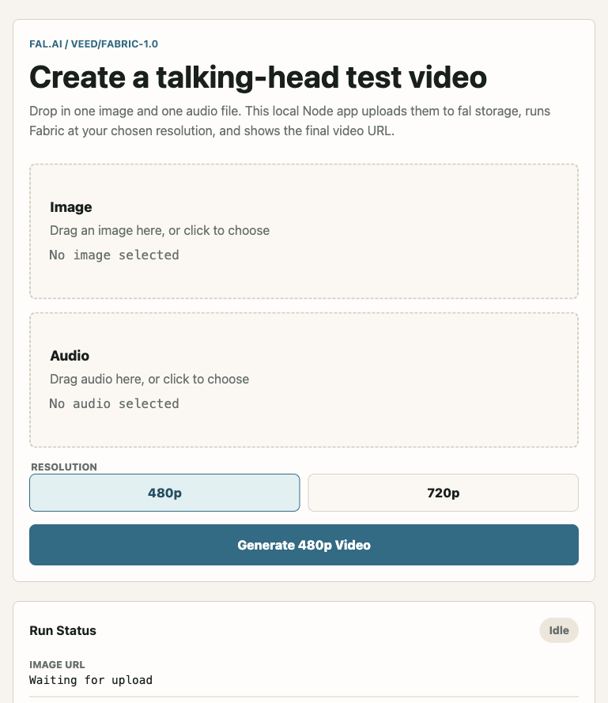

# VEED Fabric fal.ai Tester

A small Node.js web app for testing the `veed/fabric-1.0` model through fal.ai.

Upload an image and an audio file through the browser, choose `480p` or `720p`, and the app will:

- Upload both files to fal storage with explicit `fal.storage.upload()` calls
- Send the returned fal.media URLs as `image_url` and `audio_url`
- Run `veed/fabric-1.0`
- Stream queue updates and logs while generation runs
- Show the uploaded URLs, request ID, full result JSON, and final generated video URL



## Requirements

- Node.js 20 or newer
- A fal.ai API key

## Setup

Install dependencies:

```bash
npm install
```

Set your fal.ai API key:

```bash
export FAL_KEY="your_fal_api_key_here"
```

Start the app:

```bash
npm start
```

Open the local app:

```text
http://localhost:3000
```

## Usage

1. Drag or choose an image file.
2. Drag or choose an audio file.
3. Select `480p` or `720p`.
4. Click `Generate`.
5. Watch the live logs and open the final video URL when it completes.

## Notes

- Your `FAL_KEY` is read from the server environment and is never sent to the browser.
- Uploaded files are sent from the browser to your local Node server, then uploaded to fal storage by the server.
- The app validates that `FAL_KEY` is present before starting a generation request.
- `.env` files are ignored by git. Use `.env.example` only as a placeholder reference.
